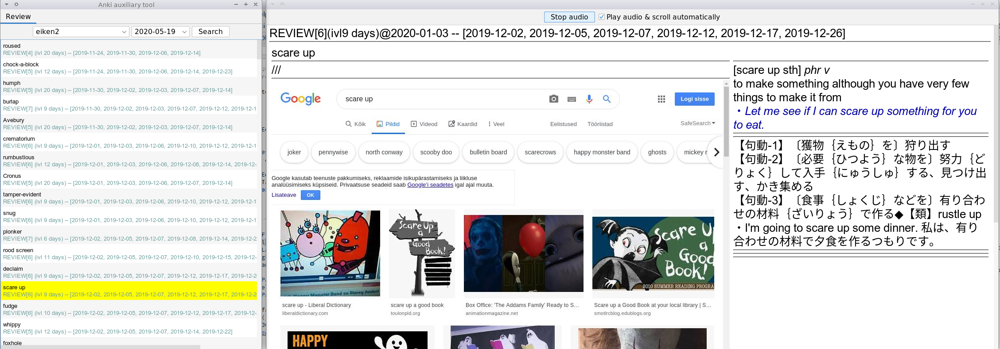
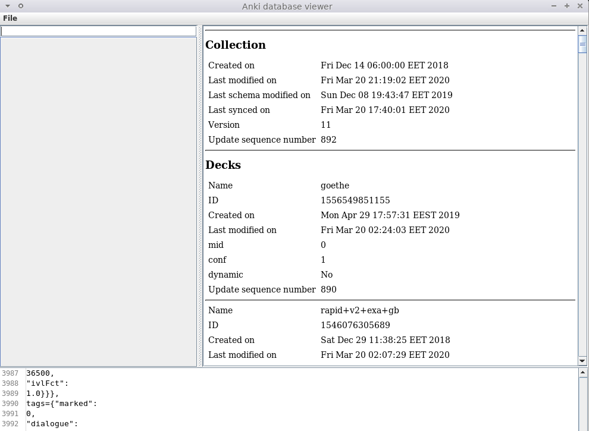
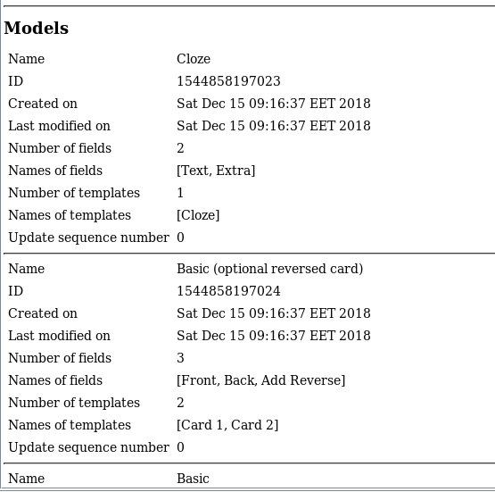
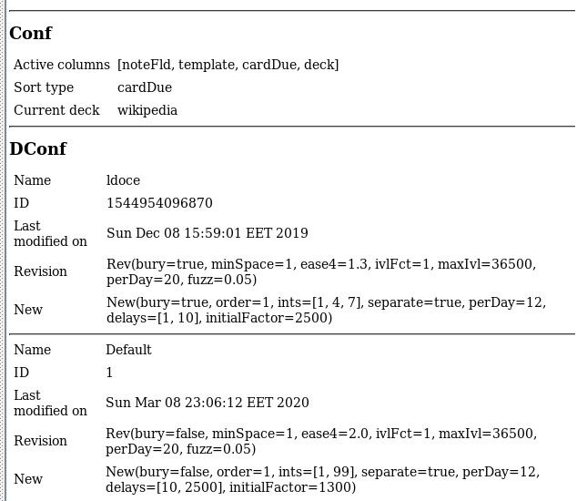

In development

This project uses kotlin, Apache DBUtils, and Jackson Object mapper.
[src/main/kotlin/com/growingspaghetti/anki/companion/model/Col.kt](./src/main/kotlin/com/growingspaghetti/anki/companion/model/Col.kt)
